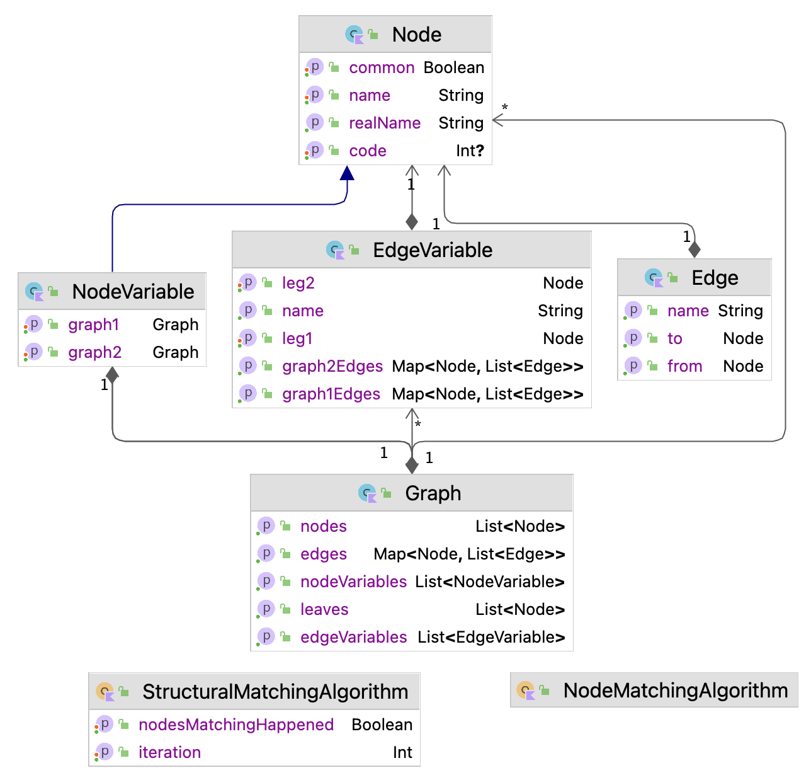

# Graph Generalization Algorithm (GGA)

This repository contains the code base developed for my Master's thesis titled "Graph Generalization in Software Engineering", available on the [University of Calgary's Vault](https://prism.ucalgary.ca/items/60e46d69-0249-4f5d-8f1c-d024d375a2c6). The thesis explores the concept of graph generalization and introduces an algorithm based on the "Multiple Vertex and Edge Variables" model to address challenges in software engineering tasks.

## Introduction

Generalization is a technique for extracting the common properties of two inputs while abstracting away their differences. This technique can be applied to different kinds of inputs, and in the course of our research, graphs are inputs that we are interested in. The graph generalization technique remains underexplored, primarily due to challenges like cyclic dependencies and semantic differences. Existing approaches often overlook structural and semantic similarities, leading to incomplete analyses. This research aimed to address these limitations by proposing a novel algorithm and formal model capable of preserving common graph-based information while abstracting differences as variables. Through applications in software engineering, the effectiveness of the proposed approach was evaluated in terms of information preservation, execution scalability, and precision in identifying important changes during software updates.

## Model Overview

We developed the Multiple Vertex and Edge Variables model that utilizes two different structural variables - vertex variables and edge variables - to abstract away differences in input graphs. Vertex variables represent subgraphs specific to each input and edge variables are used to capture differences in edge directions and connections. For more details about this model, please refer to Section 4.3 in the thesis.

## Algorithm

The graph generalization algorithm based on the Multiple Vertex and Edge Variables model is presented here. This algorithm aims to find a generalized multivariable graph given two input graphs, capturing common vertices and edges while utilizing vertex and edge variables to represent differences. 

The image below presents a simplified class diagram highlighting the key components of the implementation, including classes responsible for [managing graphs](./src/main/kotlin/ca/ucalgary/cs/graph), vertex and edge variables, and the [structural matching algorithm](./src/main/kotlin/ca/ucalgary/cs/algorithm/StructuralMatchingAlgorithm.kt) used in the preprocessing stage.

## Testing

A [comprehensive test suite](./src/test/kotlin/ca/ucalgary/cs/comparison) is developed using the JUnit library ensures the reliability and correctness of the algorithm. Various test cases cover a wide range of input scenarios, assessing its behavior across different graph structures and ensuring robustness.
